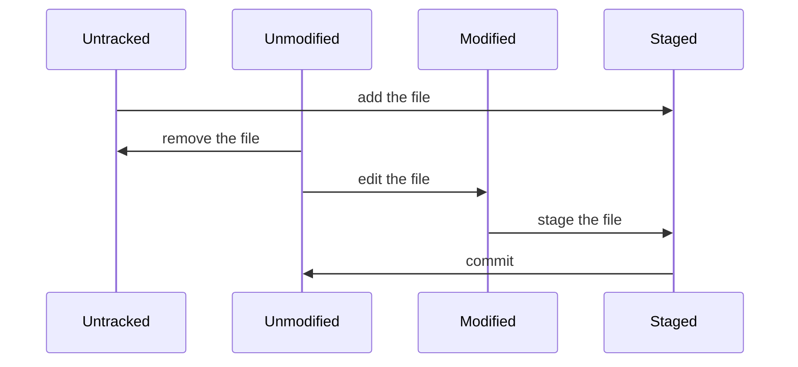

# Git with Visual Studio
### Version Control Systems (VCS)
- CVS
- Subversion
- Mercurial
- Bazaar
- TFVC
- VSS
- Git
## Git Basics
Comandos básicos de Git en línea de comandos
Configuración de identidad en Git
```bash
git config --global user.name "John Doe"
git config --global user.email johndoe@example.com
```
Clonar un repositorio
```bash
git clone https://github.com/angek37/RhinoLearningPath.git
```
Podemos inicializar un repositorio con el comando
```bash
git init
```
Con el comando *status* se verifica el estado de los archivos pertenecientes al repositorio, *add*  agrega archivos al commit que se realizará, en este caso el punto indica que deben agregarse todos los archivos, *commit* contiene un parámetro *-m* indicando que la cadena consecuente debe ser el mensaje adjunto al commit. El comando *log* con el parámetro --oneline será el que muestre una lista simple de los commit del repositorio, *push* sube los commits faltantes del repositorio remoto (origin).
```bash
git status
git add .
git commit -m "Descripción del commit"
git log --oneline
git push origin
```
## Working directory
Archivos en el *Working directory*
- Tracked Files
	- Unmodified
	- Modified
	- Staged
- Untracked Files
	- Everything else
## File Status Lifecycle

### .gitignore file
Si nuestro repositorio contiene binarios, o archivos que no es necesario que se agregen al repositorio podemos agregarlos al archivo .gitignore
> \# ignorar todo los archivos class 
> .class
> \# Añadir una excepcion
> !main.class
> \# ignora los todos los archivos dentro del directorio bin
> bin/ 
> \# ignora los archivos .txt dentro del directorio doc
> doc/*.txt
## Branch
El branch por default es *master*

crear un branch nuevo:
```bash
git branch testing
```
Creará un nuevo apuntador al mismo commit de master, para cambiar al nuevo branch es necesario ingresar el siguiente comando:
```bash
git checkout testing
```
Desde ese momento los commits se realizarán en el nuevo branch, si realizamos un checkout a master el apuntador **HEAD** se moverá al último commit de master, revirtiendo los archivos a sus snapshots. En caso de hacer un commit en master la historia se dividiría en dos ramas.

Para fusionar ambas ramas a la principal, estando en ésta (master), introducimos el siguiente comando:
```bash
git merge testing
```
En caso de que no existan conflictos, el merge se realizará de forma correcta en forma de un *commit de merge*.
Para eliminar un branch el comando es:
```bash
git branch -d testing
```
## Remote Branches
Los remote branches son referencias a branch dentro de un repositorio remoto. Estos toman la forma de *(remote) / (branch)*. e.g.:
> origin/master


